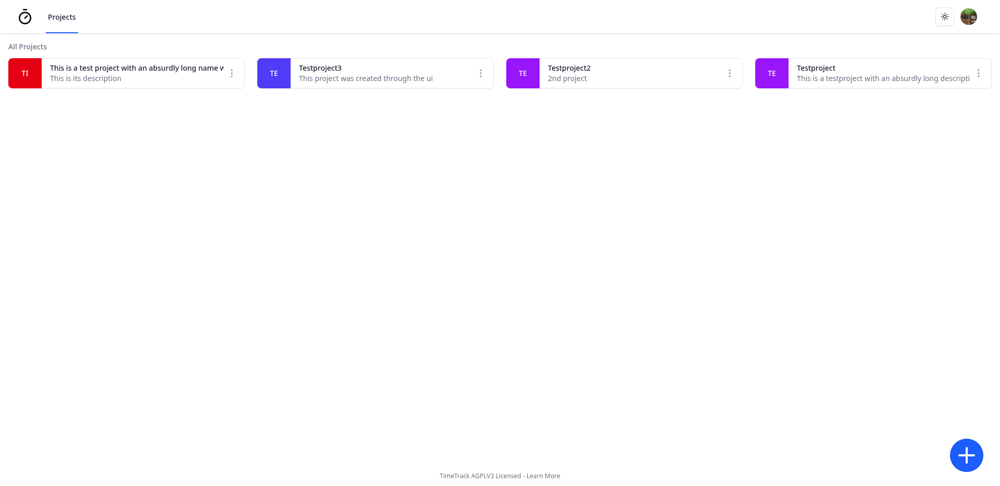

# TimeTrack

Opensource timekeeping and time tracking.

Did you ever want to know how much time you wasted on a project? no? Well now you can!

Support for multiple projects and unique time tracking per project.

## Setup

There are multiple ways to run TimeTrack

- Download and run the docker compose (`docker compose up -d`)

- Deploy on vercel (Clone the repo, change the adapter in drizzle.config.ts to whatever database provider you prefer and deploy)

- Development / bare metal (`bun install` followed by `bun run dev` or `bun run start`)

Nomatter how you run it, you will have to decide a few things and set some environment variables.

A Postgresql Database is required.

Once a database is configured, set it up using the `DATABASE_URL` environment variable.

Generate a random string for the `BETTER_AUTH_SECRET` variable and set `BETTER_AUTH_URL` to your applications base url.

Then, depending on your choice of identity provider, either set `MICROSOFT_CLIENT_ID` and `MICROSOFT_CLIENT_SECRET` or `GITHUB_CLIENT_ID` and `GITHUB_CLIENT_SECRET` to their respective values. (If both are provided, Microsoft auth is used)

For more details, see the [better-auth docs](https://www.better-auth.com/docs).

### Docker

In the simplest form, clone this repository, edit the `docker-compose.yml` and set your env variables and then run `docker-compose up -d` to start the server. This includes a postgres DB.

### Vercel

Clone the repository and run `vercel --prod` to deploy to your project. Dont forget to attach a Neon database and run `bunx drizzle-kit push` to apply the schema. (Set the appropriate env variables)

### Development

For Development, clone the repository, run `bun install` and either `bun run dev` or `bun run build` followed by `bun run start`. (again, set the appropriate env variables)

If you are not using a Neon serverless DB, copy the appropriate files from the dockerized folder and overwrite the ones in root.